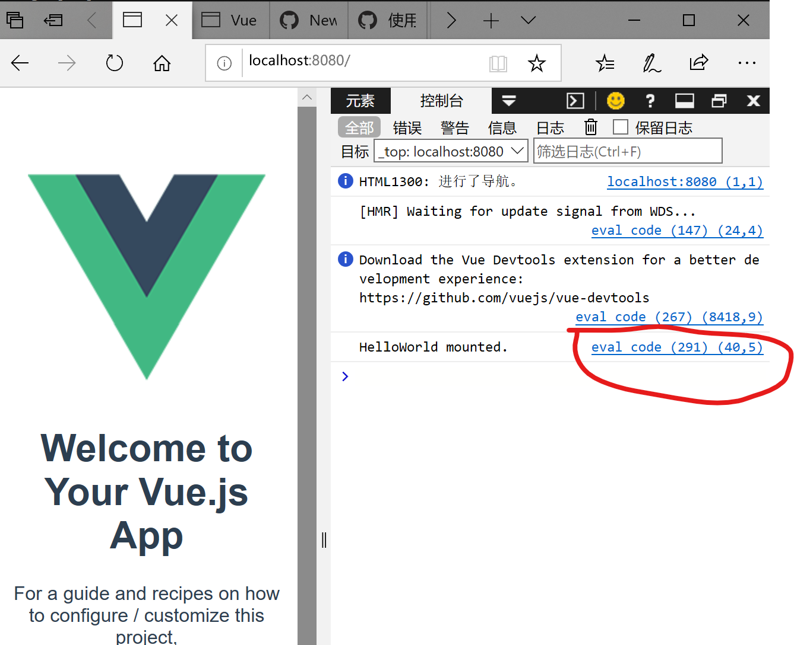
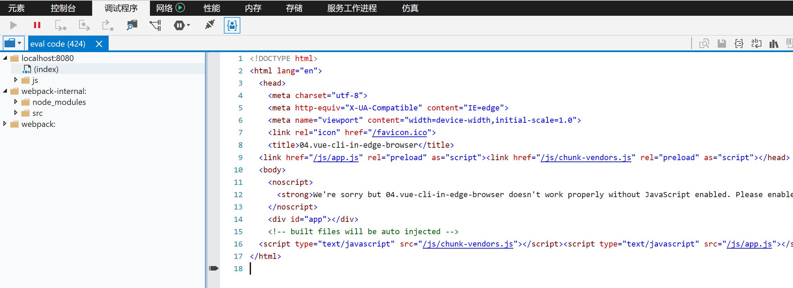
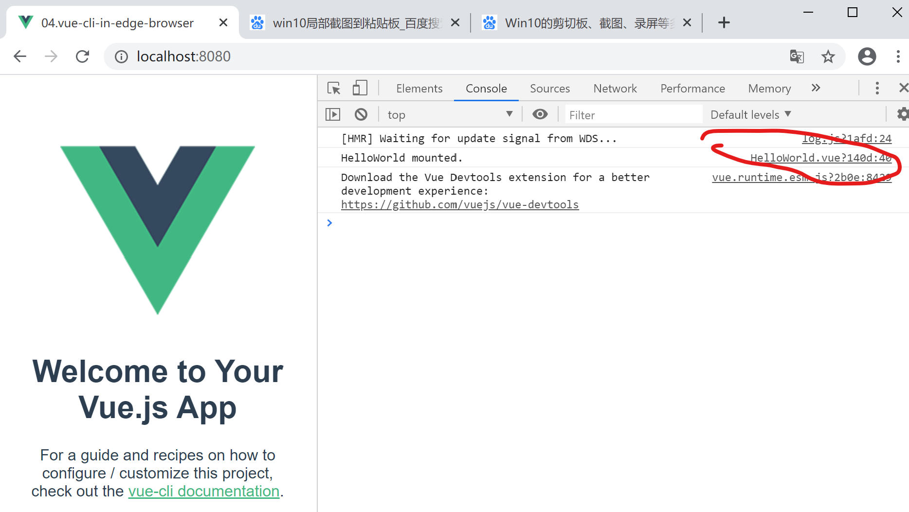
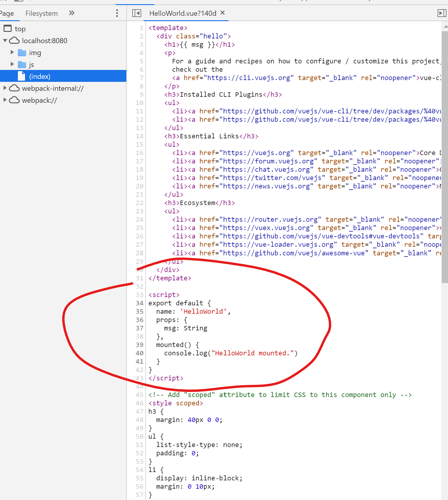

# description

This project is created by Vue Cli3. Only next codes were added in `HelloWorld.vue` to help to locate source maps in the Devloper Tool of a browser

```js
mounted() {
    console.log("HelloWorld mounted.")
  }
```

Souce maps cannot be detected in Edge browser while it works in Chrome browser.

### Edge





### Chrome





# vue-cli-in-edge-browser

## Project setup
```
yarn install
```

### Compiles and hot-reloads for development
```
yarn serve
```

### Compiles and minifies for production
```
yarn build
```

### Lints and fixes files
```
yarn lint
```

### Customize configuration
See [Configuration Reference](https://cli.vuejs.org/config/).
